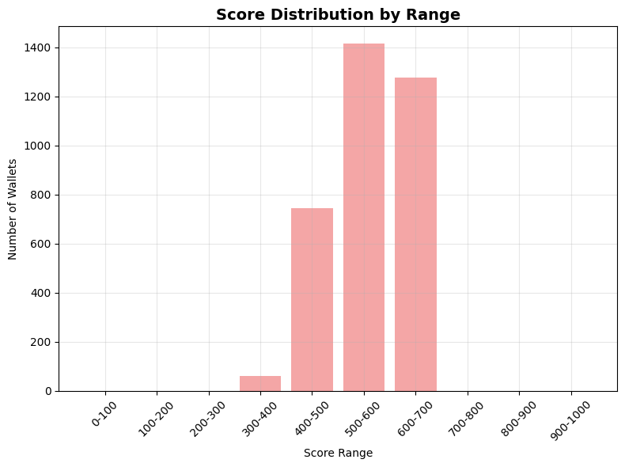

# DeFi Credit Scoring Model

## Overview

This repository contains a machine learning model to assign credit scores (0–1000) to wallet addresses based on transaction-level data from the Aave V2 protocol. The model evaluates wallet reliability and risk, with higher scores indicating responsible usage and lower scores reflecting risky or bot-like behavior. The project includes two Jupyter notebooks—**model.ipynb** for scoring and **visualizations.ipynb** for analysis—along with this **analysis.md** file summarizing the results.

## Method Chosen

The credit scoring model combines multiple components to assess wallet behavior:

* **Anomaly Detection (25% weight):** Uses Isolation Forest to identify outliers (e.g., bot-like or exploitative behavior).
* **Risk Assessment (30% weight):** Evaluates liquidation history, borrow-to-deposit ratios, and repayment frequency.
* **Stability Assessment (20% weight):** Considers account age and asset diversification.
* **Activity Patterns (15% weight):** Analyzes transaction frequency and consistency.
* **User Clustering (10% weight):** Applies K-means clustering (5 clusters) for peer comparison.

The final score is a weighted sum of these components, scaled to 0–1000, with higher scores indicating lower risk.

## Architecture

1. **Data Input**
   Raw transaction data (JSON, \~87 MB) containing wallet interactions (`deposit`, `borrow`, `repay`, etc.).

2. **Preprocessing**

   * **Feature engineering:** Creates risk (e.g., liquidation ratio), stability (e.g., account age), and activity (e.g., transactions per day) features.
   * **Missing values:** Median imputation and replacing infinite values.

3. **Modeling**

   * **Anomaly Detection:** Isolation Forest to detect anomalous behavior.
   * **Scoring Components:** Custom scoring functions for risk, stability, and activity.
   * **Clustering:** K-means groups wallets into 5 behavioral segments.

4. **Output**
   A DataFrame with wallet addresses, credit scores (0–1000), component scores, and qualitative interpretations (e.g., Excellent, Good).

5. **Analysis**
   Visualizations (histograms, bar charts, pie charts, heatmaps) explore score distributions and wallet behaviors.

## Processing Flow

1. **Data Loading**
   Load raw JSON into a pandas DataFrame.

2. **Feature Engineering**
   Extract metrics: number of liquidations, account age, unique assets, transaction frequency, etc.

3. **Anomaly Detection**
   Apply Isolation Forest to flag risky or bot-like behavior.

4. **Scoring Components**

   * **Risk score:** Based on liquidation ratio, borrow-to-deposit ratio, repayment frequency.
   * **Stability score:** Based on account age and asset diversification.
   * **Activity score:** Based on transaction patterns and consistency.

5. **Clustering**
   Group wallets into 5 clusters via K-means for peer benchmarking.

6. **Final Scoring**
   Combine weighted component scores and scale to 0–1000.

7. **Results Export**
   Save **credit\_scores.parquet** and **wallet\_features.parquet** (parquet files are in `.gitignore`).

8. **Visualization**
   In **visualizations.ipynb**, load the parquet files and generate:

   * **Score distribution histogram**
   * **Range distribution bar chart**
   * **Quality category pie chart**
   * **Behavioral metrics by score range**
   * **Component correlation heatmap**

## Results Summary

> *(Include here the key findings from your visualizations, e.g., distribution shapes, percentage in each range, notable behavioral differences. Paste generated plots or their file paths.)*

## Setup Instructions

1. **Install Dependencies**

   ```bash
   pip install -r requirements.txt
   ```

2. **Run Notebooks**

   * `model.ipynb` → generates `credit_scores.parquet` & `wallet_features.parquet`.
   * `visualizations.ipynb` → produces and saves plots.

3. **View Analysis**
   Open **analysis.md** in VS Code to review summary and embedded plot references.

## Repository Structure

```
├── model.ipynb             # Credit scoring logic and export
├── visualizations.ipynb    # Analysis and visualization
├── analysis.md             # This file
├── readme.md               # Project overview and setup
├── requirements.txt        # Python dependencies
└── .gitignore              # Excludes large .parquet files
```

