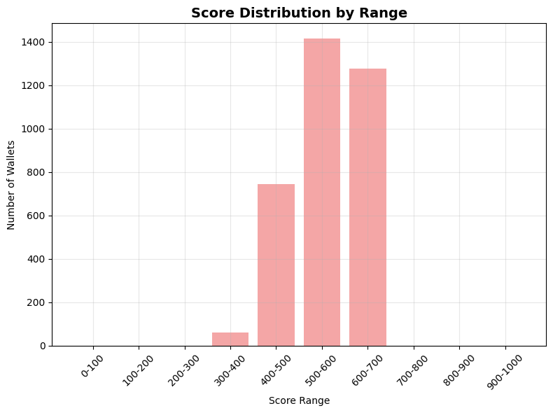
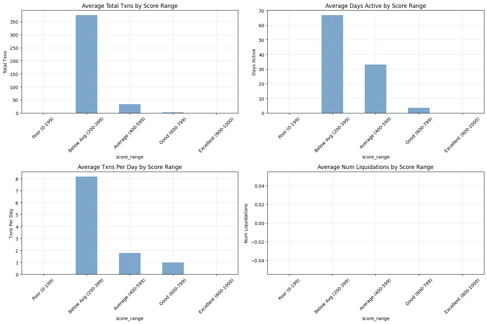
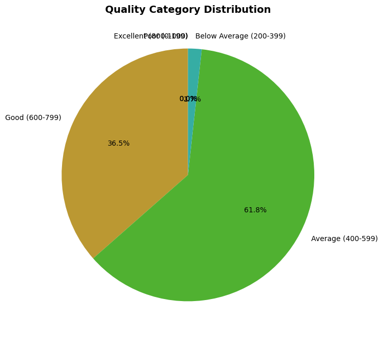

### 📊 Score Range Distribution

| Score Range | Wallet Count | Percentage |
|-------------|--------------|------------|
| 0–100       | 0            | 0.0%       |
| 100–200     | 0            | 0.0%       |
| 200–300     | 0            | 0.0%       |
| 300–400     | 61           | 1.7%       |
| 400–500     | 745          | 21.3%      |
| 500–600     | 1,415        | 40.5%      |
| 600–700     | 1,276        | 36.5%      |
| 700–800     | 0            | 0.0%       |
| 800–900     | 0            | 0.0%       |
| 900–1000    | 0            | 0.0%       |

---

### 🔍 Wallet Characteristics by Score Range

| Score Range       | Characteristics                    |
|-------------------|-------------------------------------|
| 800–1000 (High)   | No wallets found in this range      |
| 0–199 (Low)       | No wallets found in this range      |

---

### 📈 Behavioral Metrics by Score Range

#### 🧮 TOTAL_TXNS

| Score Range          | Mean   | Median | Std Dev  |
|----------------------|--------|--------|----------|
| Poor (0–199)         | NaN    | NaN    | NaN      |
| Below Avg (200–399)  | 374.52 | 28.0   | 1823.26  |
| Average (400–599)    | 34.19  | 8.0    | 74.63    |
| Good (600–799)       | 2.59   | 1.0    | 7.39     |
| Excellent (800–1000) | NaN    | NaN    | NaN      |

#### 📆 DAYS_ACTIVE

| Score Range          | Mean   | Median | Std Dev |
|----------------------|--------|--------|---------|
| Poor (0–199)         | NaN    | NaN    | NaN     |
| Below Avg (200–399)  | 66.82  | 69.0   | 41.33   |
| Average (400–599)    | 33.08  | 18.0   | 36.19   |
| Good (600–799)       | 3.50   | 1.0    | 10.16   |
| Excellent (800–1000) | NaN    | NaN    | NaN     |

#### ⏱️ TXNS_PER_DAY

| Score Range          | Mean  | Median | Std Dev |
|----------------------|-------|--------|---------|
| Poor (0–199)         | NaN   | NaN    | NaN     |
| Below Avg (200–399)  | 8.17  | 0.7    | 29.17   |
| Average (400–599)    | 1.80  | 1.0    | 2.51    |
| Good (600–799)       | 0.98  | 1.0    | 0.49    |
| Excellent (800–1000) | NaN   | NaN    | NaN     |

#### 💸 REPAY_FREQ

| Score Range          | Mean  | Median | Std Dev |
|----------------------|-------|--------|---------|
| Poor (0–199)         | NaN   | NaN    | NaN     |
| Below Avg (200–399)  | 0.15  | 0.12   | 0.15    |
| Average (400–599)    | 0.10  | 0.03   | 0.12    |
| Good (600–799)       | 0.01  | 0.00   | 0.03    |
| Excellent (800–1000) | NaN   | NaN    | NaN     |

#### 📅 ACCOUNT_AGE_DAYS

| Score Range          | Mean  | Median | Std Dev |
|----------------------|-------|--------|---------|
| Poor (0–199)         | NaN   | NaN    | NaN     |
| Below Avg (200–399)  | 65.82 | 68.0   | 41.33   |
| Average (400–599)    | 32.08 | 17.0   | 36.19   |
| Good (600–799)       | 2.50  | 0.0    | 10.16   |
| Excellent (800–1000) | NaN   | NaN    | NaN     |

#### 🧾 UNIQUE_ASSETS

| Score Range          | Mean  | Median | Std Dev |
|----------------------|-------|--------|---------|
| Poor (0–199)         | NaN   | NaN    | NaN     |
| Below Avg (200–399)  | 3.41  | 2.0    | 2.64    |
| Average (400–599)    | 3.17  | 3.0    | 2.05    |
| Good (600–799)       | 1.20  | 1.0    | 0.80    |
| Excellent (800–1000) | NaN   | NaN    | NaN     |

---

### 📊 Overall Score Statistics

| Metric                  | Value    |
|-------------------------|----------|
| Total Wallets Analyzed | 3,497    |
| Mean Score             | 554.24   |
| Median Score           | 553.14   |
| Standard Deviation     | 70.52    |
| Minimum Score          | 324.89   |
| Maximum Score          | 652.97   |

---

 ### 🏅 Quality Category Distribution

| Category           | Wallet Count | Percentage |
|--------------------|--------------|------------|
| Excellent (800–1000)  | 0            | 0.0%       |
| Good (600–799)        | 1,276        | 36.5%      |
| Average (400–599)     | 2,160        | 61.8%      |
| Below Average (200–399)| 61          | 1.7%       |
| Poor (0–199)          | 0            | 0.0%       |

### Component Score Correlation

